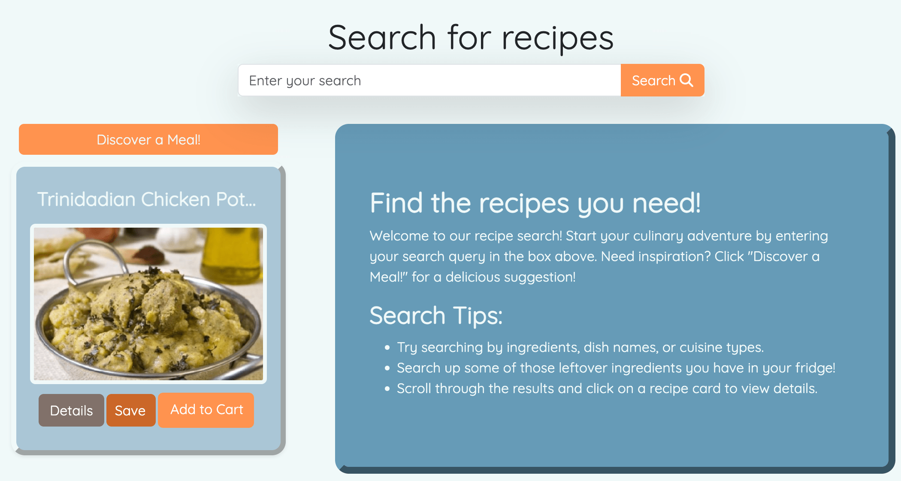
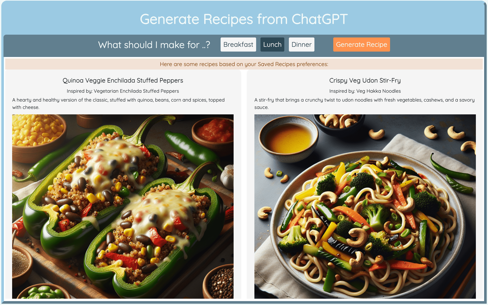
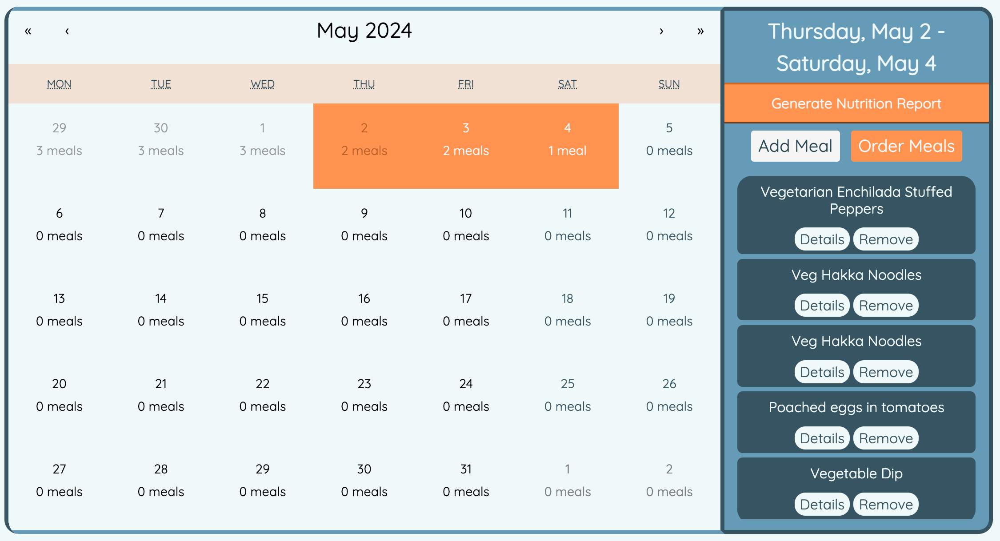
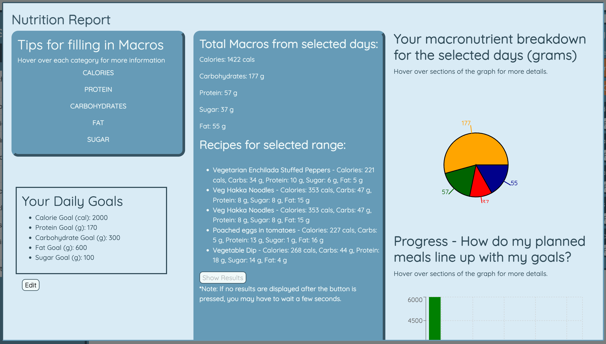
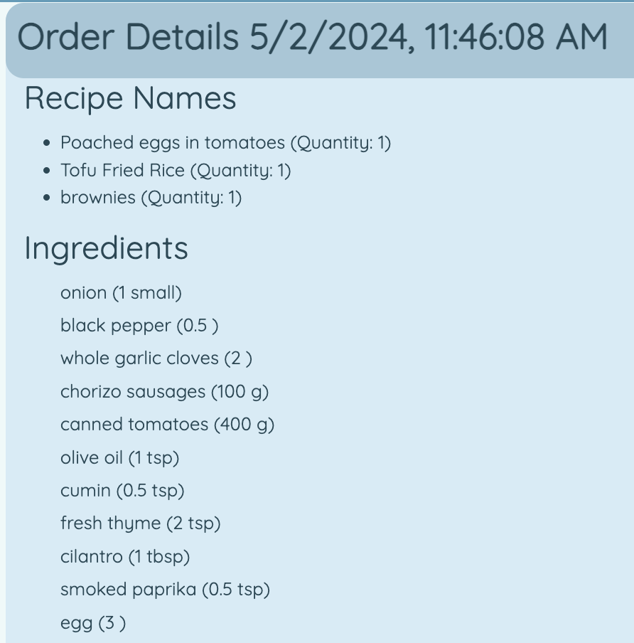

<div align="center">

# CookBook-Pro

[](https://temple-cis-projects-in-cs.atlassian.net/jira/software/c/projects/DT/issues)
[](https://github.com/ApplebaumIan/tu-cis-4398-docs-template/actions/workflows/deploy.yml)
[](https://applebaumian.github.io/tu-cis-4398-docs-template/)

</div>

## Welcome to CookBook-Pro!

Section #, as well as any words that quickly give your peers insights into the application like programming language, development platform, type of application, etc.

## Project Abstract

This document proposes a novel application of a text message (SMS or Email) read-out and hands-free call interacted between an Android Smartphone and an infotainment platform (headunit) in a car environment. When a phone receives an SMS or Email, the text message is transferred from the phone to the headunit through a Bluetooth connection. On the headunit, user can control which and when the received SMS or E-mail to be read out through the in-vehicle audio system. The user may press one button on the headunit to activate the hands-free feature to call back the SMS sender.

## High Level Overview

### Search

Discover new, mouthwatering recipes from our extensive collection of thousands of savory dishes.
Explore recipe details, add favorites to your collection, or easily add ingredients to your cart.
Simply type in your cravings and let the culinary adventure begin!
Not sure where to start? Check out the suggested meal option right under the search bar for inspiration!



### Recommendations

Feeling adventurous? 
Let our AI-powered recommendation system guide you!
Whether you're craving a specific type of cuisine or seeking culinary inspiration, our recommendation engine will spark your imagination and delight your taste buds.
Powered by GPT-4, ChefGPT will analyze your saved recipes and generate relevant breakfast, lunch, or dinner recipes.



### Create Recipe

Can't find that special recipe?
Preserve your family favorites or unleash your creativity with our recipe creator.
Add your own ingredients, instructions, and personal touches to create your modern-day cookbook.
Keep track of and share your culinary masterpieces with ease.


### Calendar

Never forget a meal again!
Plan your meals days, weeks, or even months in advance with our intuitive calendar feature.
Then, generate nutrition reports or shopping lists for those plans directly from the calendar!
From breakfast to dinner, your culinary journey starts here.



### Nutrition Report

Trying to get more shredded than shredded cheese?
Abs are made in the kitchen. 
Set and manage daily macronutrient goals, then see how your eating habits are measuring up.
You can even generate nutrition reports for meals planned in the future to make sure you're aligning with your goals.



### Ordering

Tired of boring pen & paper shopping lists?
Add saved, custom, or generated recipes to your cart, then order them to recieve an extensive ingredient list.
Ingredient lists can be emailed to you or found in order history.



## Conceptual Design

Cookbook-Pro is a primarily web-based application, developed with [React](https://react.dev/) and [Node.js](https://nodejs.org/en). The backend of the web app consists of three different sections. The web portion of the application will use [Firebase](https://firebase.google.com/), a cloud platform developed by Google. Firebase provides Cookbook-Pro with free hosting and user authentication, as well as a NoSQL database, and serverless-compute. The [Spoonacular API](https://spoonacular.com/food-api) is utilized for the recipes that appear in the search feature, as well as for ingredient and nutritional data. The recommendation system uses [OpenAI's GPT-4](https://openai.com/index/gpt-4) and [DALL-E3](https://openai.com/index/dall-e-3) models to generate recipes and images. 

## Background

Cookbook-Pro is designed to simplify a user's cooking endeavors by offering a comprehensive platform for managing, organizing, and discovering recipes. The digitization of the concept of a "cookbook" allows users to effortlessly search for recipes and perform a range of actions based on them that are not possible within a traditional cookbook. Upon visiting the website, users are presented with a home screen offering options to log in or sign up using their Google account. Once authenticated, users gain access to the full functionality of the app, with various tabs for easy navigation.

Users can manage recipes by saving pre-existing ones, creating custom recipes, or saving recipes generated by ChatGPT. The application also allows users to create meal plans on the calendar, track them, order ingredient lists, and generate nutrition reports of their meals. The nutrition report section allows users to enter their daily macronutrient goals, creating a health baseline that can be later edited if needed. It also visualizes the nutritional data of their meals. Cookbook-Pro combines all these aspects to offer a modern take on the traditional cookbook, providing users with enhanced control and management over their recipes.


## Required Resources

To run this project, the user needs an active network connection, a device with an internet browser (preferably a desktop or laptop device), and a Google account. Then, the user simply needs to navigate to the site link and sign in.

## Building from Source

To build this project from source, one needs to either clone or zip/ownload the `main` branch from GitHub.

Ensure that [Node.js](https://nodejs.org/en) is installed, then open the terminal and install all dependencies with `npm install`. 

Next, create a `.env` file. You will need to configure [Firebase](https://firebase.google.com/), acquire a [Spoonacular API](https://spoonacular.com/food-api) token, and an [OpenAI API](https://openai.com/index/gpt-4) token. 

This is the layout of the `.env` file:

```
REACT_APP_COOKBOOK_PRO_EMAIL=
REACT_APP_SPOONACULAR_API_KEY=
REACT_APP_FIREBASE_API_KEY=
REACT_APP_FIREBASE_AUTH_DOMAIN=
REACT_APP_FIREBASE_PROJECT_ID=
REACT_APP_FIREBASE_STORAGE_BUCKET=
REACT_APP_FIREBASE_MESSAGING_SENDER_ID=
REACT_APP_FIREBASE_APP_ID=
REACT_APP_FIREBASE_MEASUREMENT_ID=
REACT_APP_OPENAI_API_KEY=
```

Simply enter your tokens and Firebase configurations after the = signs.

Now, run  `npm start` in order to launch the project.

## Collaborators

[//]: # " readme: collaborators -start "

<table>
<tr>
    <td align="center">
        <a href="https://github.com/MikeDantuono">
            
            <br />
            <sub><b>Mike Dantuono</b></sub>
        </a>
    </td>
    <td align="center">
        <a href="https://github.com/evandorsey1">
            
            <br />
            <sub><b>Evan Dorsey</b></sub>
        </a>
    </td>
    <td align="center">
        <a href="https://github.com/sdutill">
            
            <br />
            <sub><b>Shawn Dutill</b></sub>
        </a>
    </td>
    <td align="center">
        <a href="https://github.com/aeskandary">
            
            <br />
            <sub><b>Ali Eskandary</b></sub>
        </a>
    </td>
    <td align="center">
        <a href="https://github.com/rltruth">
            
            <br />
            <sub><b>Ryan Lind</b></sub>
        </a>
    </td>
    <td align="center">
        <a href="https://github.com/valvardanyan">
            
            <br />
            <sub><b>Val Vardanyan</b></sub>
        </a>
    </td>
   </tr>
</table>

[//]: # " readme: collaborators -end "
